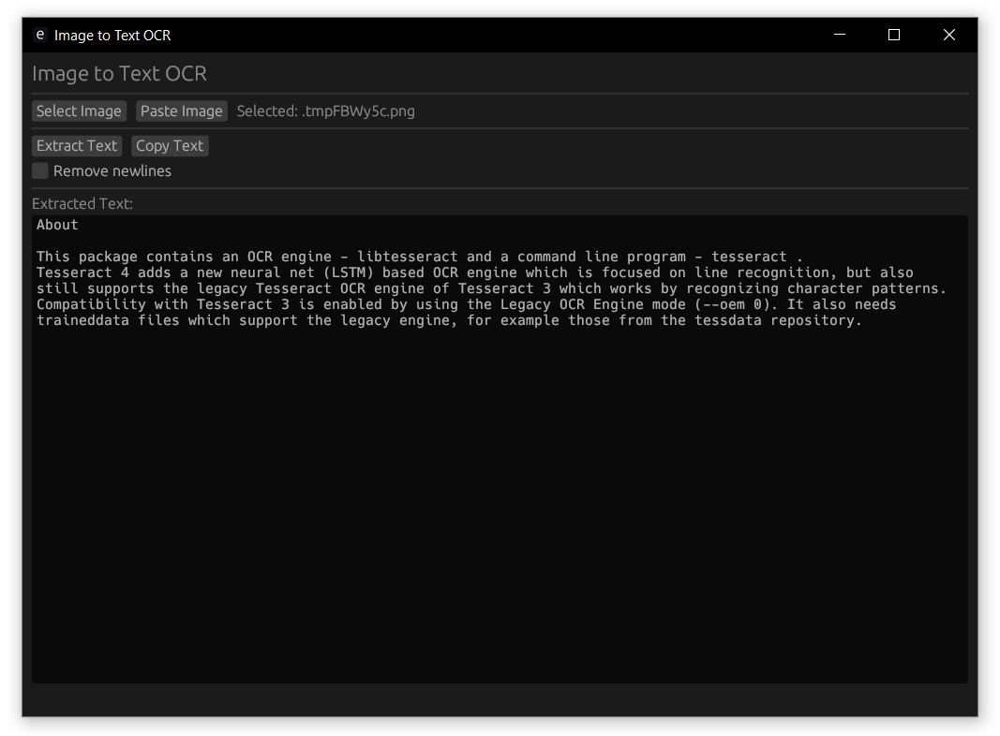

# Image to Text OCR

A simple GUI application built with Rust that extracts text from images using Tesseract OCR. Features a clean interface with support for both file selection and clipboard image pasting.

## Features

### Image Input
- **File Selection**: Select image files (PNG, JPG, JPEG, BMP, TIFF, GIF)
- **Clipboard Paste**: Paste images directly from clipboard (screenshots, copied images)

### Text Processing
- **OCR Extraction**: Extract text using Tesseract OCR
- **Newline Control**: Toggle between original formatting and single-line text

### Text Output
- **Copy to Clipboard**: One-click copying of extracted text
- **Editable Results**: Modify extracted text in the text area

## Usage

### Basic Workflow
1. **Launch**: Run `cargo run` or use the release executable
2. **Input Image**: 
   - Click "Select Image" to choose a file, OR
   - Click "Paste Image" to use clipboard content
3. **Extract**: Click "Extract Text" to process the image
4. **Format**: Toggle "Remove newlines" checkbox as needed
5. **Copy**: Click "Copy Text" to copy results to clipboard

### Interface Layout


## Building

### Development Build
```bash
cargo run
```

### Release Build
```bash
cargo build --release
```

## Project Structure

```
src/
├── main.rs    # Application entry point
├── app.rs     # Core application logic and state
├── ocr.rs     # Tesseract OCR integration
└── ui.rs      # User interface implementation
```

## Dependencies

- **egui**: Modern immediate mode GUI framework
- **eframe**: Application framework for egui
- **rfd**: Native file dialogs
- **image**: Image processing and format support
- **arboard**: Cross-platform clipboard access
- **tempfile**: Temporary file management for clipboard images
- **rusty-tesseract**: Integrated Tesseract OCR engine

## Technical Details

- **OCR Engine**: Tesseract with `preserve_interword_spaces=1` and PSM 6
- **Whitespace Handling**: Preserves original spacing without tab conversion
- **Line Ending Support**: Handles Windows (`\r\n`), Unix (`\n`), and Mac (`\r`) formats
- **Async Processing**: Non-blocking OCR with progress indicators
- **Memory Efficient**: Streams processing for large images